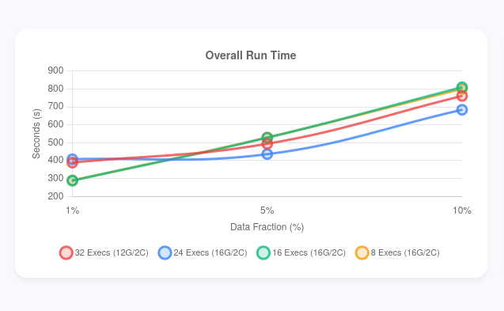
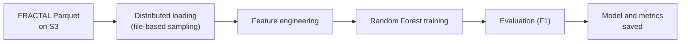

# Scaling Land Cover Classification on FRACTAL with PySpark

A distributed Random Forest pipeline that classifies every point of the FRACTAL aerial LiDAR
dataset into land cover classes with PySpark MLlib, and a study of how its runtime scales with the
number of Spark executors on an AWS EMR cluster.

**Elouann Lucas** and **Joshua Owen Mangotang**, Big Data course project, University of South
Brittany, 2025.

<p align="center">
  
</p>

## Overview

| | |
| --- | --- |
| **Data** | [FRACTAL](https://arxiv.org/abs/2405.04634): 100,000 aerial LiDAR point clouds from five French regions (250 km², about 300 GB), stored as Parquet on S3. Each point has XYZ, intensity, return number, RGB and infrared values, and a land cover label |
| **Features** | normalised height, NDVI, excess green (ExG) and normalised RGB, computed with Spark SQL expressions |
| **Model** | PySpark MLlib pipeline: VectorAssembler, StandardScaler and a Random Forest classifier |
| **Cluster** | AWS EMR with YARN, 8 worker nodes (r6i.2xlarge: 8 vCPUs and 64 GB RAM each) |



## Experiment

Each run uses 1%, 5% or 10% of the data and 8, 16, 24 or 32 executors with 2 cores each and
16 GB of memory (12 GB with 32 executors). The number of partitions scales with the cluster:
executors x cores x 4. The loading, feature engineering, training and overall times are recorded
for every run.

## Results

- **Accuracy does not depend on the cluster:** the F1 score is 0.747 at 1% of the data and 0.767 at
  5% and 10%, identical for every executor count.
- **More executors only help up to a point:** at 1% of the data, 16 executors finish fastest (about
  290 s). At 5% and 10%, 24 executors are fastest (about 440 s and 680 s), while 32 executors are
  slower again, most likely because shuffling the Random Forest statistics and reading from S3
  cost more than the extra parallelism gains.
- **Feature engineering scales well** (4 to 20 s), while data loading varied irregularly, most likely
  because some runs shared the cluster and its S3 bandwidth with other jobs.

The best executor count therefore depends on the data size; a single fixed configuration is not
optimal for every workload.

Run results in `results/` (8, 16 and 32 executors):

| Data | Executors | Records | Load (s) | Features (s) | Training (s) | Overall (s) | F1 |
| ---: | ---: | ---: | ---: | ---: | ---: | ---: | ---: |
| 1% | 16 | 59M | 49 | 4 | 186 | 288 | 0.747 |
| 1% | 32 | 59M | 175 | 4 | 179 | 390 | 0.747 |
| 5% | 8 | 249M | 249 | 5 | 322 | 622 | 0.767 |
| 5% | 16 | 249M | 264 | 5 | 217 | 529 | 0.767 |
| 5% | 32 | 249M | 66 | 8 | 386 | 495 | 0.767 |
| 10% | 8 | 491M | 93 | 20 | 557 | 751 | 0.767 |
| 10% | 16 | 491M | 99 | 20 | 599 | 811 | 0.767 |
| 10% | 32 | 491M | 333 | 7 | 346 | 761 | 0.767 |

## Repository Structure

```
train.py        the Spark job: loading, feature engineering, training, evaluation and metrics
charts.html     interactive charts of the results (open in a browser)
results/        metrics per run, named metrics_f<fraction>_x<executors>_e<cores>.json
literatures/    LiDAR HD dataset description (IGN)
assets/         figure used in this README
```

## Usage

```bash
spark-submit --deploy-mode client --master yarn \
  --packages org.apache.hadoop:hadoop-aws:3.3.1,ch.cern.sparkmeasure:spark-measure_2.12:0.27 \
  train.py --num-executors 16 --executor-cores 2 --executor-memory 16 --driver-memory 4 \
  --data "s3a://<bucket>/FRACTAL/data" --fraction 0.1 --output results
```

## Reference

Gaydon, C., Daab, M., & Roche, F. (2024). FRACTAL: An Ultra-Large-Scale Aerial Lidar Dataset for
3D Semantic Segmentation of Diverse Landscapes. [arXiv:2405.04634](https://arxiv.org/abs/2405.04634).
